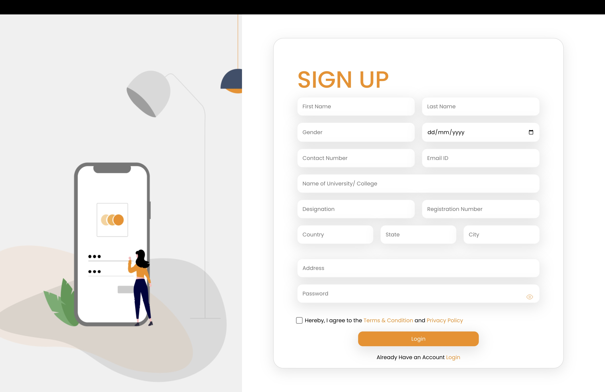

<h1>Just Getting Started</h1>

This project has the basic build for a Login and Sign Up Page, made using ReactJs
<h2>Technologies Used</h2>

<ul align="center">
 
</ul><h2>Features</h2>

<ul>
<li>Responsive View</li>
</ul><h2>Screenshots</h2>

<h2>Setup</h2>

Download the Repo and Install the required dependencies
<h5>Steps</h5><ul>
<li><code>git clone https://github.com/TartejBrothers/Just-Getting-Started.git</code></li>
</ul><ul>
<li><code>cd just-getting-started</code></li>
</ul><ul>
<li><code>npm i</code></li>
</ul><ul>
<li><code>npm audit fix</code></li>
</ul><ul>
<li><code>npm start</code></li>
</ul><h2>Contact</h2>

